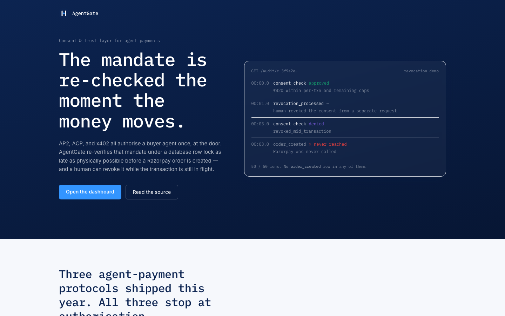
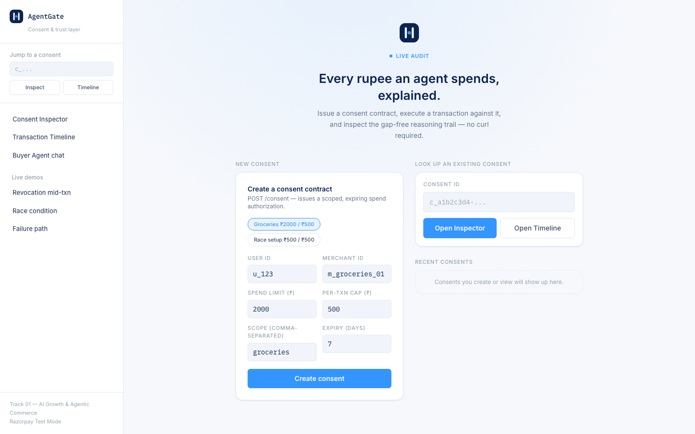
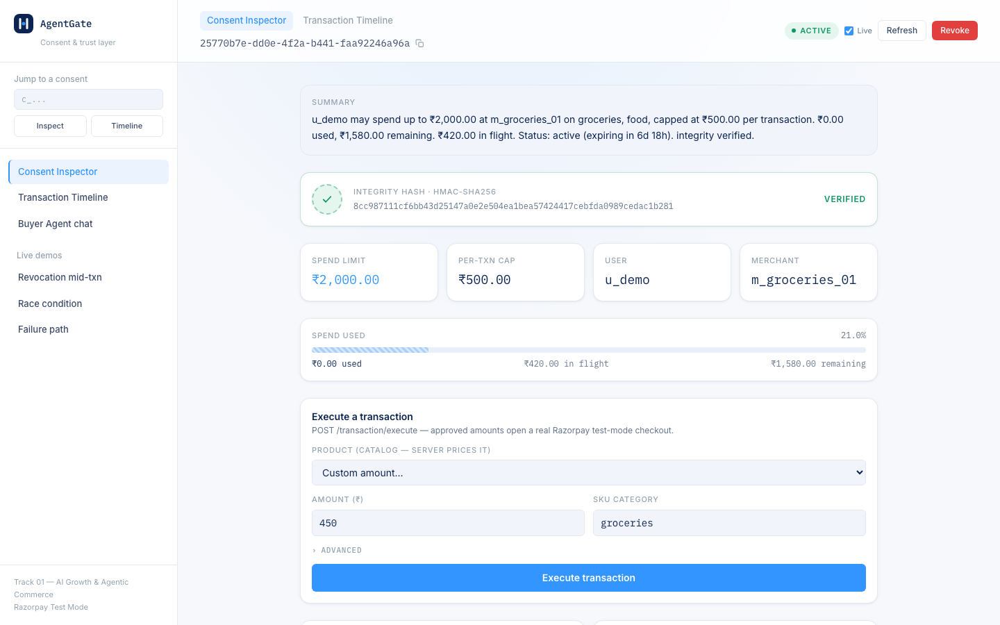
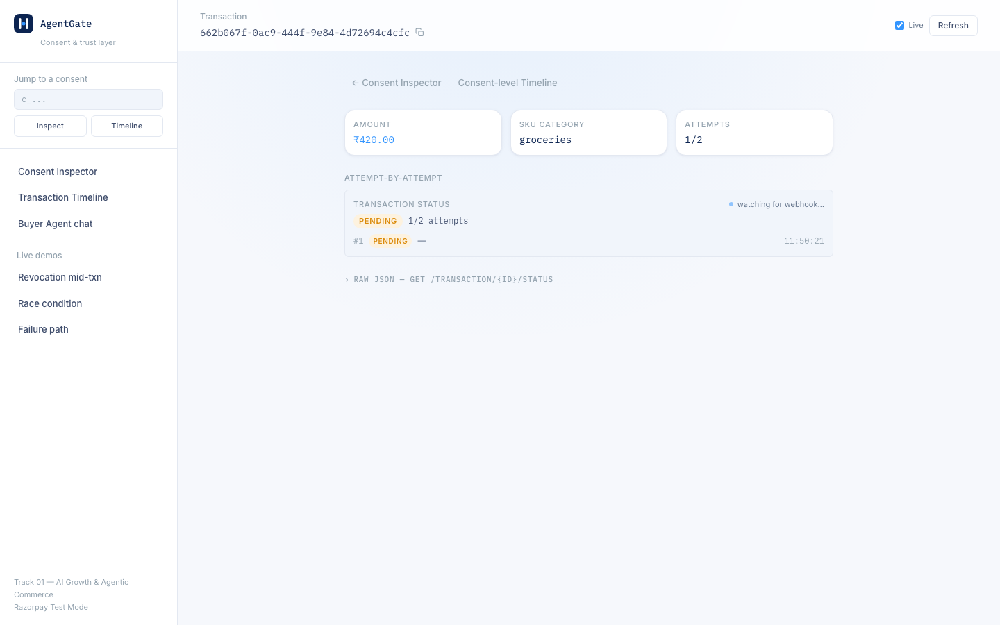
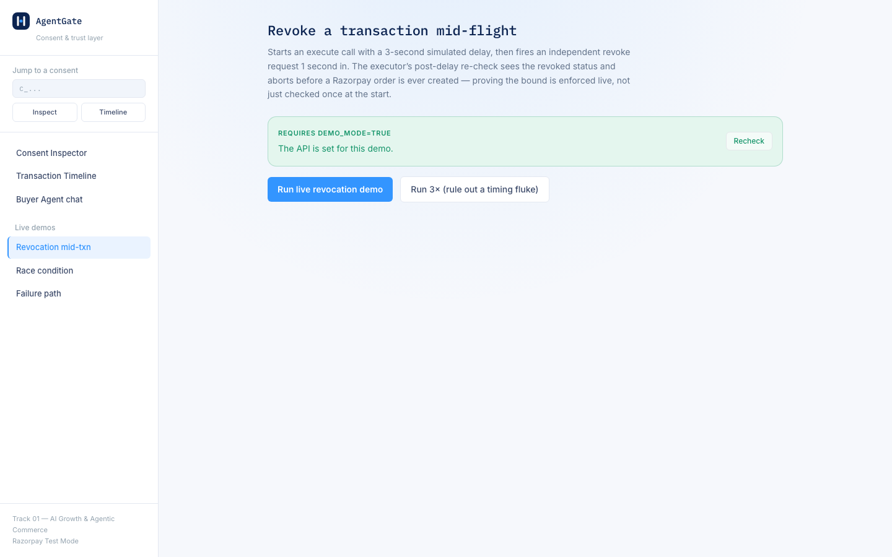
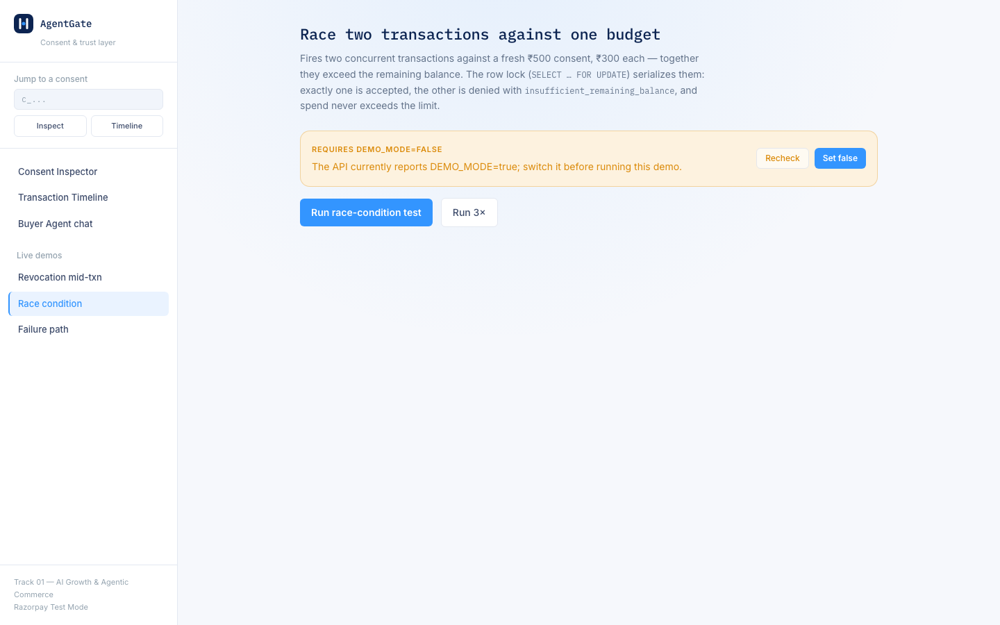
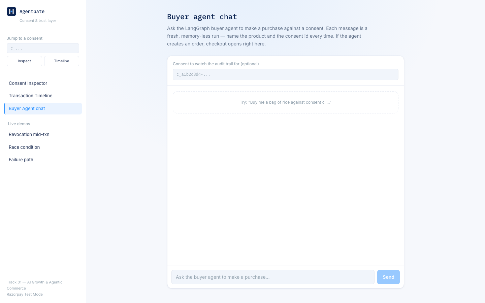
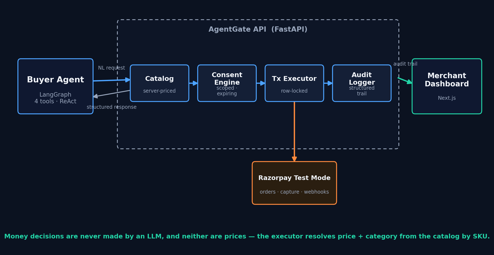

# AgentGate

**Track 01 — AI Growth & Agentic Commerce (Razorpay AI Buildathon)**

[](https://github.com/HardikShreays/AgentGate/actions/workflows/ci.yml)

Three agent-payments protocols landed this year — Google's **AP2**,
OpenAI/Stripe's **ACP**, and **x402** — and all three stop at
authorization. A mandate gets signed, an agent gets scoped spend, the
check happens at the door. None of them re-verify that mandate at the
instant money actually moves, and none of them can be pulled back
mid-transaction.

**AgentGate does both, and the repo proves it with numbers.** A buyer
agent can only spend through a scoped, expiring, tamper-evident consent
contract; the contract is re-checked under a database row lock as late as
physically possible before a Razorpay order is created; and a human can
revoke it *while a transaction is in flight* and have that revocation
land. Every check and every rupee is written to a deterministic,
queryable audit trail — never LLM-generated prose.

Measured, reproducible, on real Postgres and real Razorpay test mode:

| Claim | Evidence | Result |
|---|---|---|
| No double-spend under concurrency |  `scripts/race_test.py --runs 250` ([log](backend/scripts/results/race_250runs.log)) | **250/250** races closed correctly |
| Revocation lands mid-transaction |  `scripts/revocation_demo.py --runs 50` ([log](backend/scripts/results/revocation_50runs.log)) | **50/50** aborted before Razorpay was called |
| Suite green | `pytest tests/ -q` (CI, every push) | **67 passed** |

---

## Screenshots

<table>
<tr>
<td width="50%">

**Landing page**


</td>
<td width="50%">

**Merchant dashboard**


</td>
</tr>
<tr>
<td width="50%">

**Consent Inspector** — spend limit, integrity hash, live balance


</td>
<td width="50%">

**Transaction Timeline** — per-attempt status, webhook state


</td>
</tr>
<tr>
<td width="50%">

**Live revocation-mid-transaction demo**


</td>
<td width="50%">

**Live race-condition demo**


</td>
</tr>
<tr>
<td width="50%">

**Buyer agent chat** (LangGraph, real tool calls)


</td>
<td width="50%">

**Architecture**


</td>
</tr>
</table>

---

## 1. Problem statement

Agentic commerce demos tend to focus on the fun part — an agent that can
browse a catalog, negotiate, and check out. The hard part, and the part
that actually determines whether anyone lets an agent near their money, is
narrower and less flashy: **can the human bound what the agent is allowed
to spend, verify that the bound was actually enforced, and revoke it
mid-flight if something looks wrong?**

That's the entire bet of this project. AgentGate does not build a
marketplace, a negotiation protocol, or a multi-merchant catalog. It
builds one thing deeply: a **Consent Engine** that issues scoped, expiring,
per-transaction-capped spend authorizations with tamper-evident storage; a
**transaction executor** that is race-safe under concurrent load and closes
its consent check as late as physically possible before money moves; an
**audit logger** that produces a gap-free, deterministic reasoning trail for
every decision; and a **live revocation demo** that proves the bound is
enforced *during* a transaction, not just checked at the door.

### What this deliberately does not do

**There is still no per-human login.** A first pass at this section said
every endpoint was open — that was true, and it was the single biggest
hole a reviewer would find. It's closed at the layer that matters: every
mutating endpoint (`POST /consent`, `POST /consent/{id}/revoke`,
`POST /transaction/execute`) now requires a signed `(X-Principal-Id,
X-AgentGate-Key)` header pair (`app/auth.py`), the key is
`HMAC(AGENTGATE_HMAC_SECRET, principal_id)` — the same secret and pattern
already used for the consent integrity hash — and the API enforces that
the calling principal actually owns the consent it's acting on. A caller
without the secret can no longer create, spend against, or revoke *any*
consent; "any caller can revoke someone else's consent" is no longer true
of the raw API. What's still missing is real user login: the dashboard has
no session system, so it is one trusted client holding the shared secret
and asserting a principal on a human's behalf (`frontend/lib/serverAuth.ts`
+ the `app/api/agentgate/*` proxy routes, which is also why the secret
never reaches the browser). Putting a real authenticated session in front
of the dashboard — so the *human*, not the dashboard process, is the
credentialed principal — is the honest remaining gap, and it's a login
integration, not a consent-engine redesign: `require_principal` in
`app/auth.py` is exactly the seam it plugs into.

Also out of scope, with reasons, in [Future Work](#10-future-work):
multi-merchant catalogs, negotiation, velocity limiting, circuit breakers.

---

## 2. Architecture

```
┌──────────────────┐      NL request       ┌────────────────────┐
│   Buyer Agent     │──────────────────────▶│   AgentGate API     │
│ (LangGraph, 4     │◀──────────────────────│   (FastAPI)         │
│  tools, ReAct loop)│  structured response  │  ┌───────────────┐  │
└──────────────────┘                        │  │ Catalog        │  │
                                             │  │ (server-priced)│  │
                                             │  └───────┬───────┘  │
                                             │  ┌───────▼───────┐  │
                                             │  │ Consent Engine │  │
                                             │  └───────┬───────┘  │
                                             │          │          │
                                             │  ┌───────▼───────┐  │
                                             │  │ Tx Executor    │──┼───▶ Razorpay Test Mode API
                                             │  │ (row-locked)   │  │      (orders, capture, webhooks)
                                             │  └───────┬───────┘  │
                                             │          │          │
                                             │  ┌───────▼───────┐  │
                                             │  │ Audit Logger   │  │
                                             │  │ (reasoning +   │  │
                                             │  │  structured    │  │
                                             │  │  JSON per row) │  │
                                             │  └───────────────┘  │
                                             └──────────┬──────────┘
                                                         │
                                             ┌───────────▼──────────┐
                                             │  Merchant Dashboard   │
                                             │  (Next.js) — consent  │
                                             │  inspector, tx        │
                                             │  timeline, live demos │
                                             └───────────────────────┘
```

**Stack:** FastAPI (Python 3.11+) · PostgreSQL · LangGraph (single ReAct
node, 4 bound tools) · Razorpay Test Mode API · Next.js + TypeScript ·
Docker Compose.

Money decisions are never made by an LLM, and neither are prices. The agent
picks an item from a server-side catalog (`app/catalog.py`) by SKU; the
executor resolves the price and category from that SKU and **discards any
amount the caller supplied**. The agent's system prompt is explicit that it
may only act through its four tools, but the prompt is not the enforcement —
the tools call directly into `app/consent.py` and `app/executor.py`, the
same functions the plain HTTP API uses. So a hallucinated "sure, that
worked" from the model has no way to move money, and a hallucinated price
has no way to reach Razorpay.

---

## 3. What's built, by phase

| Phase | Status | Where |
|---|---|---|
| 1 — Consent Engine | Done | `backend/app/consent.py`, `backend/app/schemas.py` |
| 2 — Executor + Razorpay integration | Done | `backend/app/executor.py`, `backend/app/razorpay_client.py`, `backend/app/webhooks.py` |
| 3 — Audit Logger | Done | `backend/app/audit.py` |
| 4 — Failure path | Done | `backend/app/failure.py` |
| 5 — Buyer agent + revocation demo | Done | `backend/app/agent.py`, `backend/scripts/revocation_demo.py` |
| 6 — Merchant dashboard | Done | `frontend/app/consent/[id]`, `frontend/app/transactions/[id]` |
| 7 — Packaging | This document + `docker-compose.yml` + `scripts/race_test.py` |
| 8 — Agent-readable catalog | Done | `backend/app/catalog.py`, `GET /catalog` |

### What broke, and how it was fixed

The rubric asks for this directly. The non-trivial ones:

- **Synchronous capture was wrong.** Razorpay's actual flow is *create
  order → checkout on Razorpay's page → webhook confirms the result*; a
  backend never synchronously "captures" a payment itself. `execute_transaction`
  now returns `status: "pending"` with the order ID, and `spend_used` is
  incremented only once `POST /webhooks/razorpay` verifies a
  `payment.captured` event — never optimistically in the executor. A
  deliberate deviation from a literal reading of Appendix A.4 step 8, and
  safer than what the appendix describes.
- **A row lock alone did not stop double-spend.** Because `spend_used` only
  advances on webhook confirmation, two concurrent executes both read the
  same `spend_used` under their own turn at the lock and both passed the
  balance check. Fixed with `spend_reserved`: a *written* hold placed under
  the lock, in the same DB transaction as the check, so the commit that
  releases the lock also persists the hold. Settled into `spend_used` on
  capture, released on hard-stop failure, abandoned-checkout sweep, or
  mid-transaction revocation.
- **Abandoned checkouts leaked budget.** A closed Razorpay modal produces no
  webhook, so the `spend_reserved` hold was permanent. Added a lazy sweep
  (`executor.release_stale_reservations`) that runs on the next execute, the
  next dashboard read, and any read of `GET /transaction/{id}/status` — no
  scheduler — and expires holds past `RESERVATION_TTL_SECONDS`.
- **The sweep couldn't tell "abandoned" from "paid, webhook never arrived."**
  Locally there is no webhook tunnel, so a genuinely-paid order would always
  be expired. The sweep now calls `order.fetch` on Razorpay before writing a
  row off (`reconcile_pending_order`): `paid` → capture it, not-paid →
  expire, Razorpay unreachable → leave it pending and retry next sweep. And
  a capture (webhook or reconciliation) that lands on an already-`expired`
  row is now accepted — `spend_used` still advances, with a
  `reconciled_from: expired` marker in the audit row — instead of being
  silently dropped, which would have left the trail claiming ₹0 spent on a
  payment that actually cleared.
- **`Transaction.attempts` was referenced before it was declared.** The
  column was used throughout `failure.py` / `webhooks.py` but never added to
  the model; `attempt_count` (an int) was being mutated in its place, which
  crashed on the first real payment failure.
- **SQLAlchemy silently skipped attempt-timeline writes.** In-place mutation
  of the `attempts` JSON list left old and new values pointing at the same
  objects, so the change-detection diff saw nothing and skipped the UPDATE.
  Every writer now builds fresh dicts.
- **`verify_webhook_signature` moved.** Appendix A.15 says
  `razorpay.utils.verify_webhook_signature`; on the pinned SDK (2.0.1) it is
  `client.utility.verify_webhook_signature`, raising
  `SignatureVerificationError`. Confirmed against the installed package.
- **The buyer agent replayed instead of buying.** `idempotency_key` was a
  tool parameter the LLM filled in; at `temperature=0` it produced the same
  string every run, so every request after the first hit the executor's
  idempotency short-circuit and returned an old transaction id with no new
  order. Now scoped to the `run_agent()` call and hidden from the model.
- **The agent flow dead-ended at `pending`.** `POST /agent/message`
  returned only text, discarding the `razorpay_order_id`, so the chat UI
  had no way to open Checkout — the transaction sat pending until the
  reservation sweep expired it. The endpoint now returns the order/txn ids
  and the chat opens Checkout.js exactly like the dashboard execute panel.

---

## 4. API contract

Every mutating endpoint below (`POST /consent`, `POST /consent/{id}/revoke`,
`POST /transaction/execute`) requires two headers: `X-Principal-Id: <user_id>`
and `X-AgentGate-Key: <hex HMAC-SHA256(AGENTGATE_HMAC_SECRET, user_id)>`
(`app/auth.py`). A missing/invalid key is `401`; a valid key for a principal
that doesn't own the consent being acted on is `403`. Read-only endpoints
(`GET /consent/{id}`, `GET /catalog`, `GET /audit/{id}`, …) are unauthenticated,
same as before.

### Consent

`POST /consent` — create a contract.
```json
{"user_id": "u_123", "merchant_id": "m_groceries_01",
 "spend_limit": 2000.00, "per_txn_max": 500.00,
 "scope": ["groceries"], "expiry_days": 7}
```
→ `201`, full contract including `integrity_hash` and a freshly-recomputed
`integrity_valid` flag (never trusted from storage — recomputed on every
read). The `X-Principal-Id` header must equal `user_id` in the body — a
principal can only create a consent for itself.

`GET /consent/{id}` — same shape, plus `revoked_at`.

`POST /consent/{id}/revoke` → `{"consent_id": "...", "status": "revoked", "revoked_at": "..."}`.
The authenticated principal must be the consent's `user_id`.

### Catalog

`GET /catalog` (optional `?category=`) — the agent-readable merchant
catalog: `{"merchant_id", "product_count", "products": [{"sku", "name",
"category", "price"}]}`. This is the "what is there to buy, and what does it
cost" half of *transactable by an AI buyer end to end*. Prices are served
from here and **re-resolved server-side at execute time** — a caller cannot
name its own price.

### Transactions

`POST /transaction/execute`
```json
{"consent_id": "c_...", "sku": "sku_rice_5kg",
 "idempotency_key": "client-generated-uuid", "simulate_delay_ms": 0}
```
Pass a `sku` and the price + category come from the catalog; any `amount`
in the body is ignored. For a non-catalog purchase, pass `amount` +
`sku_category` instead (still supported — the race and revocation demo
scripts use it). `simulate_delay_ms` is capped at 5000 and only honored
under `DEMO_MODE`. The authenticated principal must own `consent_id`.

Sequence: catalog price resolution → abandoned-reservation sweep →
idempotency lookup → `check_consent` → `SELECT ... FOR UPDATE` row lock →
re-check under lock + write the `spend_reserved` hold (closes the
exhaustion race window) → (if `DEMO_MODE=true` and `simulate_delay_ms>0`)
sleep, then re-check once more (this is what catches mid-flight revocation)
→ create the real Razorpay order. Capture is confirmed later,
asynchronously, by the webhook — see the design note above.

Denied response shape:
```json
{"transaction_id": null, "status": "denied", "reason": "per_txn_max_exceeded",
 "reasoning": "Denied: ₹600 exceeds per-transaction cap of ₹500."}
```

`GET /transaction/{id}/status` — full per-attempt timeline (original
attempt, any bounded retry, final outcome), independent of the
consent-scoped audit trail; this is what the dashboard's Transaction
Timeline page reads directly. Also runs the reservation sweep for this
transaction's consent, so a row a user is watching resolves (reconcile
with Razorpay → capture or expire) instead of polling `pending` forever.

`POST /webhooks/razorpay` — `payment.captured` / `payment.failed`, HMAC
signature verified via the pinned SDK's
`client.utility.verify_webhook_signature()`; a bad signature is rejected
with `400` before anything is written.

### Audit

`GET /audit/{consent_id}` — the full, ordered, gap-free reasoning trail
for a consent contract. Every row pairs a deterministic, template-generated
human-readable `reasoning` string with a `structured_payload` JSON blob,
so the trail is both readable and queryable — never LLM-generated prose.

### Agent

`POST /agent/message` — `{"message": "..."}` → runs the LangGraph buyer
agent once. Returns `{response, consent_id?, transaction_id?,
razorpay_order_id?, status?, reason?}` — the trailing fields are populated
only when the run created a real Razorpay order, so the dashboard chat can
open Checkout and finish the purchase instead of the flow dead-ending at
`pending` (the reservation sweep would expire it 15 minutes later). No
streaming, no session persistence across calls.

The agent has four tools: `browse_catalog_tool` (find a SKU + price from a
product named in words), `check_consent_tool`, `execute_transaction_tool`
(pass the SKU, not an amount), `get_status_tool`. Typical flow for *"buy me
a bag of rice"* is browse → check → execute → summarize, so the hard
iteration cap is 4 (raised from 3 when the browse step was added); the 5th
turn is forced to plain text with any sneaked-in tool calls stripped.

**The idempotency key is not the model's to choose.** At `temperature=0`
the LLM invents the same literal string on every run, so an identical
request would silently replay the first transaction forever. `run_agent()`
mints a UUID per invocation and the key is `{run_id}:{sku}` — a retry
*within* one run dedups correctly, every new run genuinely transacts. The
`execute_transaction_tool` no longer exposes `idempotency_key` at all.

### Demo triggers (DEMO_MODE only)

`POST /demo/simulate-failure` — `{"transaction_id": "..."}` invokes the
real `FailureHandler` on a pending transaction, exactly as a verified
`payment.failed` webhook would. Returns `404` when `DEMO_MODE` is off.
Backs the dashboard's one-click failure-path demo so the "one failure
handled gracefully" segment doesn't require driving Razorpay's mock-bank UI
twice.

---

## 5. Consent contract schema

```python
consent_id: UUID (PK)
user_id: str
merchant_id: str
spend_limit: Decimal
spend_used: Decimal (default 0)     # advances only on webhook capture
spend_reserved: Decimal (default 0) # held under the row lock at execute
                                     # time; settled into spend_used on
                                     # capture, released on failure /
                                     # revocation / abandoned-checkout sweep
per_txn_max: Decimal
scope: list[str]              # e.g. ["groceries", "food"]
expiry: datetime              # UTC
status: Enum["active","expired","revoked","exhausted"]
integrity_hash: str           # hex HMAC-SHA256 over the contract's
                               # immutable fields, sorted-key canonical JSON
created_at: datetime
revoked_at: datetime | None
```

Real example (`POST /consent` response):
```json
{"consent_id": "c_3f9a2e...", "user_id": "u_123", "merchant_id": "m_groceries_01",
 "spend_limit": 2000.00, "spend_used": 0.00, "spend_reserved": 0.00,
 "per_txn_max": 500.00, "scope": ["groceries"], "expiry": "2026-09-03T00:00:00Z",
 "status": "active", "integrity_hash": "a3f9c1e0b8...",
 "created_at": "2026-08-27T00:00:00Z", "revoked_at": null}
```

`check_consent()` is a pure function checking, in order: existence →
integrity hash → status (revoked/exhausted) → expiry → SKU validity and
scope match → per-transaction cap → remaining balance
(`spend_limit − spend_used − spend_reserved`). A tampered stored field
fails the integrity check and hard-denies with `integrity_violation` — it
is never silently corrected. `spend_reserved` is deliberately **not** part
of the integrity hash: the hash covers only immutable contract terms, so a
routine reservation must not invalidate it (same reason `spend_used` is
excluded).

---

## 6. Agent reasoning flow

```
 user message
      │
      ▼
 ┌──────────┐   tool_calls?  ┌────────────────────────┐
 │  agent    │───────yes────▶│ ToolNode                │
 │ (ReAct)   │                │ browse_catalog_tool     │
 │           │                │ check_consent_tool      │
 │           │◀───tool result─│ execute_transaction_tool│
 └────┬──────┘                │ get_status_tool         │
      │no tool_calls          └────────────────────────┘
      ▼
 final response
```

Max 4 tool-call iterations (`MAX_ITERATIONS=4` — raised from 3 so the
browse → check → execute → summarize path fits). On what would be a 5th
round, the graph forces a final plain-text response summarizing what was
attempted — any tool calls the model tries to sneak into that forced turn
are stripped before the message is emitted, so the hard stop is a property
of the graph, not of the model's cooperation.

**The tools do no money logic themselves.** `check_consent_tool` and
`execute_transaction_tool` call straight into `app.consent.check_consent`
and `app.executor.TransactionExecutor.execute` — the exact same functions
the plain REST API uses. If the model never calls a tool, or claims a
purchase succeeded without a tool result saying so, there is simply no
transaction and no consent mutation. Every `check_consent_tool` call also
writes its own `consent_check` audit row (Phase 3's rule: if a consent
check happened, there is a log row), independent of whatever the executor
logs a moment later — an agent asking "is this allowed?" and the executor
re-verifying it under a row lock are two distinct, both-real events.

Neither is the **idempotency key** the model's to choose — see the note
under the Agent API above. It is scoped to the `run_agent()` invocation, so
identical requests across runs each transact and a retry inside one run
replays, without the model ever seeing the key.

---

## 7. Protocol narrative

`ConsentContract` is deliberately shaped to be a recognizable stand-in for
an NPCI UAP-style mandate: `spend_limit` and `per_txn_max` map to the
mandate's authorized amount fields, `expiry` maps to mandate validity, and
`scope` maps to a purpose code restricting what the mandate can be used
for — while `check_consent()` and `execute_transaction()` mirror MCP
tool-call semantics (a structured, typed, allow/deny-decided call rather
than free-form agent prose), which is exactly how the buyer agent invokes
them in Phase 5. AgentGate doesn't implement NPCI's UAP or MCP directly —
that's a real protocol integration effort, not a buildathon-week task —
but the data model and call shape are chosen so that swapping in a real
mandate issuer or a real MCP transport later is a mapping exercise, not a
redesign.

**Against the other protocols in the race:**

- **Google's AP2 (Agent Payments Protocol)** builds on *mandates* — a
  user-signed authorization delegating scoped spend to an agent, with a
  cart mandate committing a specific amount to a specific merchant.
  `ConsentContract` is that intent mandate (`spend_limit`, `per_txn_max`,
  `scope`, `expiry`), and a catalog-priced `execute_transaction` call — a
  fixed SKU, a server-resolved price, one merchant — is the cart-mandate
  step. AgentGate's addition is that the mandate is *re-verified under a row
  lock at the moment money moves* and revocable mid-flight, not just
  checked at signing time.
- **x402** revives HTTP `402 Payment Required` as the transport: a resource
  server answers with a payment challenge, the client pays, the request
  is retried. AgentGate's deny → (authorize / top up consent) → retry loop
  is the same shape one level up — a denied `execute_transaction` returns a
  structured, machine-readable `reason` (`per_txn_max_exceeded`,
  `insufficient_remaining_balance`, …) that an agent acts on exactly like a
  402 challenge, rather than free-form prose it has to interpret.
- **ACP (Agentic Commerce Protocol, OpenAI/Stripe)** standardizes the
  merchant-side catalog feed and checkout handoff. `GET /catalog` is a
  deliberately minimal stand-in for that feed.

AgentGate implements none of these wire formats — that's real integration
work, not a buildathon week. The point is that the data model and the
call/response shapes are already the right shape to map onto them.

---

## 8. Running it

### Quick start (Docker Compose)

```bash
git clone <this-repo>
cd agentgate
cp .env.example .env
# fill in real RAZORPAY_KEY_ID / RAZORPAY_KEY_SECRET / RAZORPAY_WEBHOOK_SECRET
# and GROQ_API_KEY if you want to exercise the buyer agent
docker compose up --build
```
- API: `http://localhost:8000`
- Dashboard: `http://localhost:3000`

`db`, `api`, and `web` are three services; `api` waits on Postgres's
`pg_isready` healthcheck, `web` waits on `api`. Nothing is mounted as a
dev volume — this is a demo build, not a hot-reload dev setup.

**Schema note:** `init_db()` runs `Base.metadata.create_all()`, which
creates missing *tables* but never adds a *column* or a Postgres *enum
value* to something that already exists. If you are upgrading a database
with data you want to keep, run the forward-only migration runner:

```bash
cd backend && python -m scripts.migrate   # .env pointing at the DB
```

It is idempotent (`ADD COLUMN IF NOT EXISTS` / `ADD VALUE IF NOT EXISTS`)
and currently covers `transactions.sku`, `consent_contracts.spend_reserved`,
`transactionstatus.expired`, and `actiontype.reservation_released`. If you
don't care about the data, `docker compose down -v` (or deleting
`backend/agentgate.db` for local SQLite) and letting `create_all()` rebuild
from scratch is simpler.

### Local dev (without Docker)

```bash
# backend
cd backend
cp .env.example .env   # edit with real keys
pip install -r requirements.txt --break-system-packages
uvicorn app.main:app --reload

# frontend, in a second terminal
cd frontend
cp .env.local.example .env.local
npm install
npm run dev
```

You'll need `NEXT_PUBLIC_RAZORPAY_KEY_ID` in `frontend/.env.local` for
local Next.js dev. If you run through Docker Compose, the web image gets
that public key from the root `.env` at build time. You'll also need
`AGENTGATE_HMAC_SECRET` in `frontend/.env.local`, matching the backend's
value exactly — the dashboard's own `app/api/agentgate/*` routes use it to
sign create/spend/revoke calls server-side (see §1 and §4). Docker Compose
already wires this up: `web` gets `AGENTGATE_HMAC_SECRET` from the root
`.env` and `INTERNAL_API_URL` from `docker-compose.yml` automatically.

For pure webhook testing, Razorpay's servers must be able to reach
`/webhooks/razorpay` (e.g. `ngrok` during local dev), and that URL plus
the webhook secret must be registered in the Razorpay dashboard. The
dashboard also has a verified `/transaction/confirm` fallback: after
Checkout.js returns success, the browser sends Razorpay's signed
`order_id/payment_id/signature` tuple to the API, and the API verifies it
server-side before marking the transaction captured. This keeps local dev
usable when no public webhook tunnel is configured.

---

## 9. Testing

```bash
cd backend
pip install -r requirements.txt --break-system-packages
python -m pytest tests/ -v
```

67 tests across `test_audit.py`, `test_executor.py`, `test_webhooks.py`,
`test_failure_path.py`, `test_revocation.py`, `test_agent.py`,
`test_catalog.py`, `test_demo_mode.py`, and `test_auth.py`. The `mock_razorpay` fixture in
`tests/conftest.py` patches exactly the network boundary
(`app.executor.get_client` / `app.executor.create_order`) — row locking,
audit logging, idempotency, reservation holds, and webhook signature
verification all run for real, unmocked.

### Happy path
```bash
# every mutating call needs a signed principal header pair (§4) — compute
# it once for this shell:
KEY=$(python3 -c "import hmac,hashlib,os; print(hmac.new(os.environ.get('AGENTGATE_HMAC_SECRET','dev-only-change-me').encode(), b'u_1', hashlib.sha256).hexdigest())")

curl -X POST localhost:8000/consent \
  -H 'content-type: application/json' -H 'X-Principal-Id: u_1' -H "X-AgentGate-Key: $KEY" -d '{
  "user_id": "u_1", "merchant_id": "m_groceries_01",
  "spend_limit": 2000, "per_txn_max": 500,
  "scope": ["groceries"], "expiry_days": 7}'
# take the returned consent_id, then buy a catalog item by SKU:
curl -X POST localhost:8000/transaction/execute \
  -H 'content-type: application/json' -H 'X-Principal-Id: u_1' -H "X-AgentGate-Key: $KEY" -d '{
  "consent_id": "<id>", "sku": "sku_rice_5kg", "idempotency_key": "demo-1"}'
# → status "pending", amount 420.00 (from the catalog, not the request)
```

### Bounded rejection (per-txn cap)
Same consent, `"sku": "sku_earbuds"` (₹1899, electronics) → `status:
"denied"` — `"reason": "out_of_scope"` for a groceries-only consent, or
`"per_txn_max_exceeded"` if you widen the scope, even with budget
remaining.

### Race-condition test (A.6)
Requires runtime demo mode off. In the dashboard, open
`/demo/race` and click **Switch demo mode off** if needed.
```bash
python backend/scripts/race_test.py --base-url http://localhost:8000 --runs 250
```
Fires two concurrent `execute_transaction` requests that together exceed
remaining balance; asserts exactly one is accepted, one is denied with
`insufficient_remaining_balance`, and `race_condition_detected` is logged.

**Measured: 250/250 races closed correctly** — 250 fresh consent
contracts, 500 concurrent requests, 250 accepted, 250 denied with
`insufficient_remaining_balance`, zero double-spends. Run against
PostgreSQL 17 and live Razorpay test mode; `--runs` defaults to 3 for a
quick check. This number is only meaningful on Postgres — SQLite ignores
`SELECT ... FOR UPDATE`, so the row lock the test exercises does not
exist there.

### Failure path
Force a real failure in Razorpay's test-mode checkout by choosing
**Failure** on the mock bank page, or by using one of Razorpay's
documented error-simulation test cards (check
`razorpay.com/docs/payments/payments/test-card-details/` at build/run
time — these change). `FailureHandler` then: retries once after
`FAILURE_RETRY_DELAY_SECONDS` → on a second failure, marks the
transaction terminal, logs a simulated merchant notification, and hard
stops — a 3rd attempt is provably never created, even if the handler is
invoked again on an already-terminal transaction
(`test_failure_path.py::test_hard_stop_is_provably_enforced_no_third_attempt_even_if_handle_called_again`).

For the pitch, the dashboard's `/demo/failure` page runs this in one click
(requires demo mode on): it executes a real transaction, then drives
`POST /demo/simulate-failure` three times — the first triggers the bounded
retry, the second the hard stop and `merchant_notified` row, the third
does nothing — and shows the attempt stepper and audit trail. Same
`FailureHandler`, no fabricated timeline; it just skips clicking "Failure"
on Razorpay's mock-bank screen twice.

### Revocation-mid-transaction demo (the "wow" moment)
Requires runtime demo mode on. In the dashboard, open
`/demo/revocation` and click **Enable revocation demo mode** before
running it. This toggles the API process at runtime; no backend restart
is required.
```bash
python backend/scripts/revocation_demo.py --base-url http://localhost:8000 --runs 50
```
Kicks off `execute_transaction` with `simulate_delay_ms=3000` on a
background thread; 1 second in, revokes the same consent from a second,
genuinely separate HTTP request; the executor's post-delay re-check sees
`revoked_mid_transaction` and aborts *before* calling Razorpay. Audit
trail shows `consent_check` (approved) → `revocation_processed` →
`consent_check` (denied) → no `order_created` row.

**Measured: 50/50 runs aborted before Razorpay was called** — every run
denied with `revoked_mid_transaction`, no `order_created` audit row in any
of them. `--runs` defaults to 3; 50 rules out a timing fluke rather than
merely suggesting it.

**Remember:** switch demo mode off before running the race-condition test
or recording the happy-path/failure-path parts of the pitch video —
`simulate_delay_ms` must never be honored outside the revocation demo.

---

## 10. Future work

Deliberately **not** built, and deliberately not folded into the four
things above:

- **Velocity / rate limiting** — a real idea (cap requests per minute,
  not just per rupee), just not this build's job.
- **Circuit breakers / timeout degradation** — graceful backend
  degradation under load; orthogonal to consent and trust.
- **Multi-merchant catalog federation** — AgentGate authorizes spend
  against *a* merchant; it doesn't decide *which* merchant.
- **Bundle negotiation / multi-agent buyer-vs-merchant negotiation** —
  a different, harder problem (mechanism design, not consent
  enforcement) that would have diluted the depth of the core bet.
- **A real NPCI UAP / MCP transport implementation** — see the protocol
  narrative above; the data model is shaped to make this a mapping
  exercise later, not attempted here.
- **Real human login in front of the dashboard** — per-principal
  request signing is now enforced at the API (`app/auth.py`); a real
  session/login system authenticating the human behind that principal is
  what's left, called out in
  [What this deliberately does not do](#what-this-deliberately-does-not-do).

---

## 11. Repo layout

See `backend/app/*.py` for one module per concern (`consent.py`,
`executor.py`, `failure.py`, `audit.py`, `webhooks.py`, `agent.py`,
`catalog.py`, `razorpay_client.py`), `backend/scripts/` for the three
demo/test scripts (`revocation_demo.py`, `race_test.py`, `agent_demo.py`),
`backend/tests/` for the pytest suite, and `frontend/app/` for the
dashboard: consent inspector, transaction timelines, buyer-agent chat, and
three one-click live demos (`demo/race`, `demo/revocation`, `demo/failure`).

`.env` is git-ignored everywhere in this repo — `.env.example` (root, for
Docker Compose) and `backend/.env.example` / `frontend/.env.local.example`
(for local dev) contain placeholder values only. Never commit real
`RAZORPAY_KEY_SECRET`, `RAZORPAY_WEBHOOK_SECRET`, `AGENTGATE_HMAC_SECRET`,
`GROQ_API_KEY`, or a real `DATABASE_URL`.
